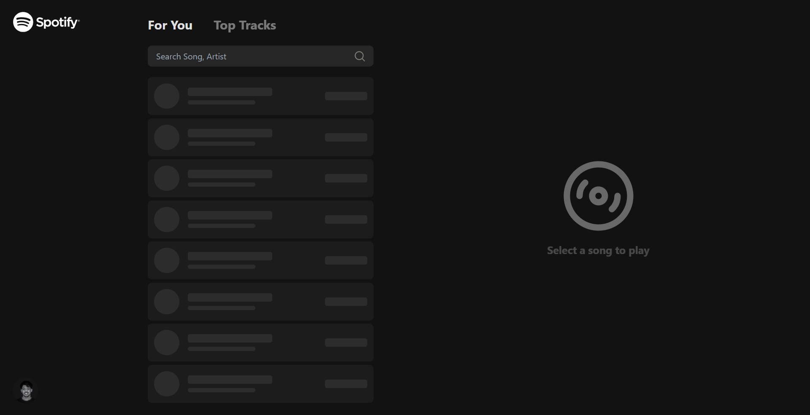
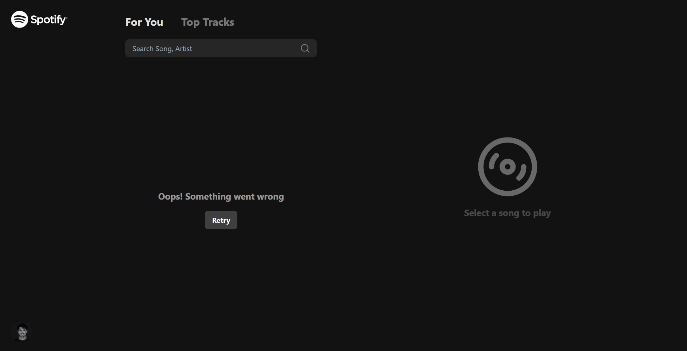
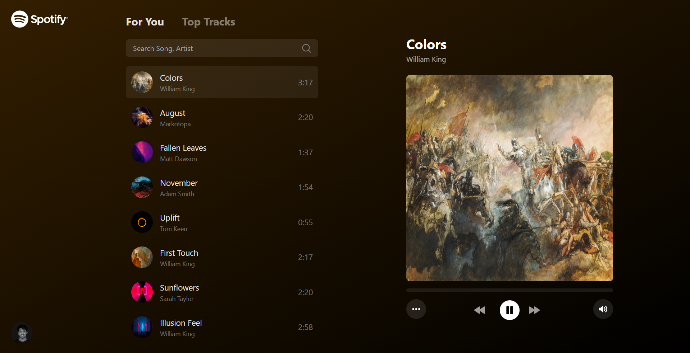
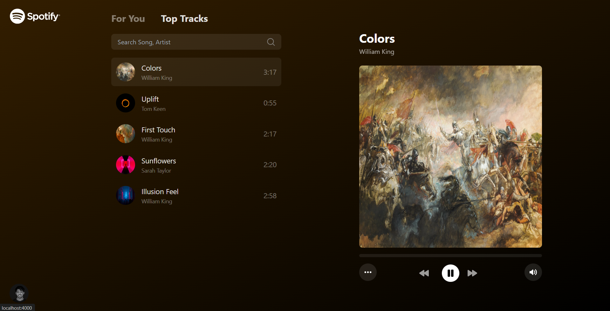
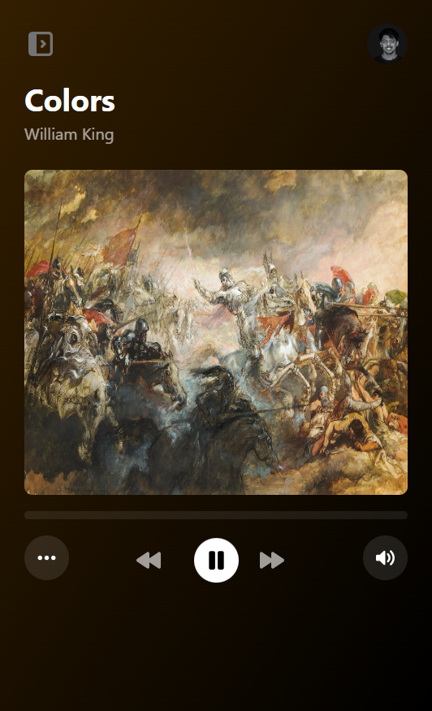
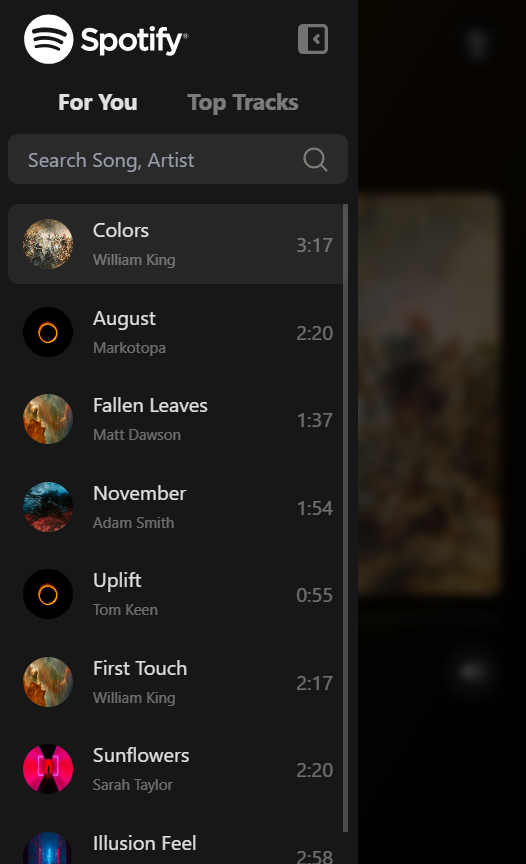

# Music Player UI - Project Documentation

🌐 Website: [samespace-music-ui](https://samespace-music-ui.vercel.app/)

## Project Overview

    The Music Player UI is a web application that allows users to browse, search, and play music tracks. 
    It features a responsive design, real-time background color changes, and seamless playback across 
    different browser tabs.

<p align="center">
  <p>Initial loading & error fallback UI</p>
  <p>
  
  
  </p>
  <p>Main component with different tabs</p>
  <p>
  
  
  </p>
  <p>Responsive screen(mobile view) UI with sidebar to list all songs</p>
  <p>
  
  
  </p>
</p>

## Project Specifications

### Design
- Figma Design Link: [Music Player UI Design](https://www.figma.com/file/RtKhzEeeuD2FtRsg2dxSep/Front-end-Assessment?type=design&node-id=1-2&mode=design&t=zEkwOdYyaeNx0z7m-4)

### API Integration
- API Endpoint: https://cms.samespace.com/items/songs
- Image URL Format: https://cms.samespace.com/assets/{COVER_IMAGE_ID}

**Note**: The API will return different titles, artists, cover images, and durations, but the URL for every song will be the same.

## Technical Requirements

1. **Framework**: React JS
2. **API Integration**: Use REST API to load list data
3. **Responsive Design**: Adapt layout for smaller screens
4. **Cross-tab Functionality**: Music continues playing when user switches tabs
5. **Dynamic Styling**: Background gradient color changes based on the current song's cover image
6. **Animations**: Implement fluid transitions and animations (e.g., list loading, background color change)

## Functionality

The Music Player UI includes the following features:

1. [✔️] **Search**: Allow users to search for songs and artists
2. [✔️] **Music Control**: 
   - Play/Pause
   - Next Track
   - Previous Track
   - Mute/Unmute
3. [✔️] **Tab Navigation**: Allow switching between `For You` and `Top Tracks` sections
4. [✔️] **Playback Control**: Implement a seeker to control music playback position

## Responsive Design

- For smaller screens, the player component should be the main interface
- Implement a menu button to show the list of songs on mobile devices in a sidebar.

## User Interface

1. **Song List**: Display a scrollable list of songs with cover art, title, artist, and duration
2. **Now Playing**: Show currently playing song details and cover art
3. **Playback Controls**: Include play/pause, next, previous, seeker and volume controls
4. **Search Bar**: Implement a search input for filtering songs
5. **Tab Navigation**: Create tabs for `For You` and `Top Tracks` sections

## Development Guidelines

1. **Code Organization**: Use a modular approach with separate components for different UI elements
2. **State Management**: Implement global state management for handling playback, current song, and UI states
3. **Typing**: Use TypeScript for type safety and better code documentation
4. **Styling**: Utilize CSS-in-JS or a CSS framework like Tailwind CSS for styling components
5. **Error Handling**: Implement proper error handling for API requests and audio playback
6. **Performance**: Optimize for performance, especially when handling large lists of songs
7. **Accessibility**: Ensure the UI is accessible, with proper ARIA labels and keyboard navigation

## Deployment

1. **Version Control**: Use Git for version control and submit the project as a GitHub repository
2. **Hosting**: Deploy a working demo on Vercel.

## Getting Started

To set up the project locally:

1. Clone the repository
   ```bash
    https://github.com/debrajhyper/Music-Player-UI.git
   ```
2. navigate to the code directory
   ```bash
    cd Music-Player-UI
   ```
3. Install dependencies: `npm install`
4. Create a `.env` file in the root where package.json located and paste the api endpoints accordingly.
    ```bash
    VITE_API_SONGS_URL=https://cms.samespace.com/items/songs
    VITE_API_SONG_COVER_IMG_URL=https://cms.samespace.com/assets/
    ```
6. Start the development server: `npm run dev`

## Build and Deployment

To build the project for production:

1. Run the build command: `npm run build`
2. Deploy the built files to your chosen hosting platform

For detailed instructions on deploying to Vercel, refer to their respective documentation.


## Available Scripts

In the project directory, you can run the following scripts:

- `npm run dev`: Starts the development server using Vite.
- `npm run build`: Builds the project for production. It runs TypeScript compiler and then builds the project with Vite.
- `npm run lint`: Runs ESLint to check for code quality and style issues.
- `npm run preview`: Serves the production build locally for preview.

## Development Tools

The project utilizes these development tools:

- `vite` (v5.4.1): A modern frontend build tool that provides a faster and leaner development experience.
- `typescript` (v5.5.3): A typed superset of JavaScript that compiles to plain JavaScript.
- `eslint` (v9.9.0): A tool for identifying and reporting on patterns found in ECMAScript/JavaScript code.
- `tailwindcss` (v3.4.10): A utility-first CSS framework for rapidly building custom user interfaces.
- `@vitejs/plugin-react-swc` (v3.5.0): Vite plugin that uses SWC to transform React code.
- `autoprefixer` (v10.4.20): A PostCSS plugin to parse CSS and add vendor prefixes to CSS rules.
- `postcss` (v8.4.41): A tool for transforming CSS with JavaScript.

## Additional Notes

- The project uses SWC (Speedy Web Compiler) for faster compilation of React code.
- ESLint is configured with plugins for React hooks and React refresh to ensure best practices and optimal performance.
- The project is set up with TypeScript for type safety and better developer experience.
- Tailwind CSS is used for styling, providing a utility-first approach to CSS.
